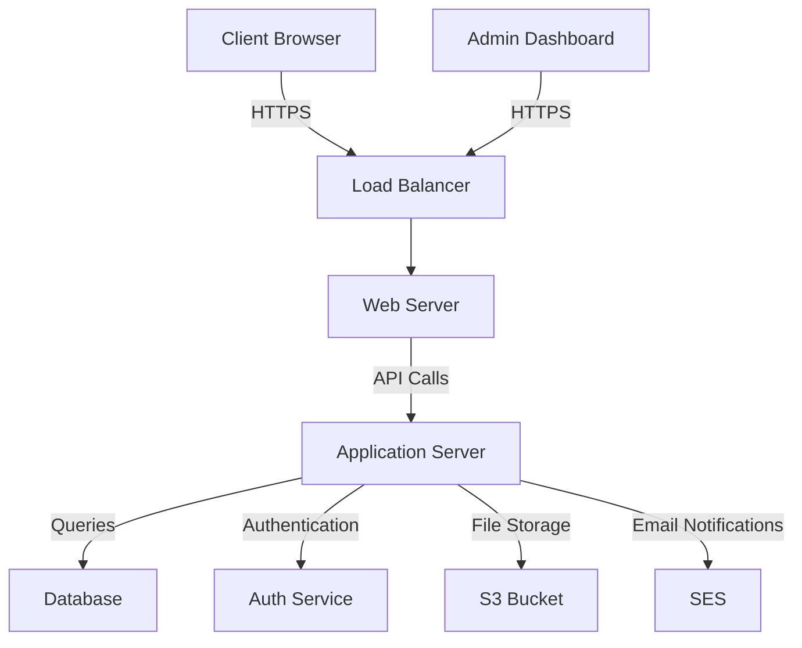
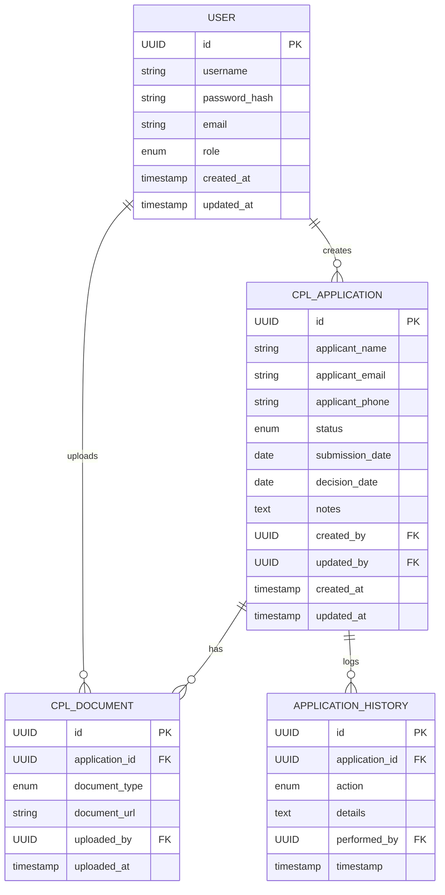

# Technical Implementation Plan: CPL Database

## Problem Statement

The current process for managing Conditional Permanent Living (CPL) applications is manual and inefficient. There's a need for a centralized database system to streamline the application process, improve data management, and enhance reporting capabilities for the CPL program.

## Scope

### Must Have:

- Web-based application for CPL data management
- User authentication and authorization system
- Database to store CPL application data
- Data entry forms for CPL applications
- Search and filter functionality
- Reporting capabilities
- Data export functionality

### Nice to Have:

- Integration with existing systems (e.g., email, document management)
- Mobile-responsive design
- Automated notifications for application status updates
- Dashboard for quick overview of CPL program statistics

### Not in Scope:

- Public-facing application portal for applicants
- Integration with payment systems
- Automated decision-making for CPL applications

## Architectural Details

### System Architecture:

1. Frontend: React.js single-page application
2. Backend: Node.js with Express.js framework
3. Database: PostgreSQL
4. Authentication: JWT (JSON Web Tokens)
5. API: RESTful API for communication between frontend and backend
6. Hosting: AWS (Amazon Web Services)

### Key Components:

1. User Management Module
2. CPL Application Module
3. Search and Filter Module
4. Reporting Module
5. Data Export Module

## Data Migrations

1. Identify existing data sources (e.g., spreadsheets, legacy databases)
2. Design data migration scripts to transform and load existing data into the new database schema
3. Implement data validation and cleaning processes
4. Perform test migrations in a staging environment
5. Schedule and execute the final data migration

## Model Proposals

### User

- id: UUID (primary key)
- username: String
- password: String (hashed)
- email: String
- role: Enum (Admin, Manager, Staff)
- createdAt: Timestamp
- updatedAt: Timestamp

### CPLApplication

- id: UUID (primary key)
- applicantName: String
- applicantEmail: String
- applicantPhone: String
- status: Enum (New, In Progress, Approved, Rejected)
- submissionDate: Date
- decisionDate: Date
- notes: Text
- createdBy: UUID (foreign key to User)
- updatedBy: UUID (foreign key to User)
- createdAt: Timestamp
- updatedAt: Timestamp

### CPLDocuments

- id: UUID (primary key)
- applicationId: UUID (foreign key to CPLApplication)
- documentType: Enum (Passport, Visa, Employment Letter, etc.)
- documentUrl: String
- uploadedBy: UUID (foreign key to User)
- uploadedAt: Timestamp

## Feature Flags

1. `enable-reporting`: Controls access to the reporting module
2. `enable-data-export`: Controls access to the data export functionality
3. `enable-advanced-search`: Controls access to advanced search and filter options

## High-Level Architecture

The CPL Database system follows a client-server architecture:

1. **Client**: React.js single-page application accessed via web browsers.
2. **Load Balancer**: Distributes incoming traffic across multiple web servers for high availability.
3. **Web Server**: Nginx servers to handle static content and route requests.
4. **Application Server**: Node.js with Express.js, handling business logic and API requests.
5. **Database**: PostgreSQL for data storage.
6. **Auth Service**: Handles user authentication and authorization.
7. **S3 Bucket**: For storing uploaded documents and generated reports.
8. **SES (Simple Email Service)**: For sending email notifications.
9. **Admin Dashboard**: Separate React application for system administration.

## Component Design

1. **User Management Module**

   - Responsibilities: User registration, authentication, and authorization
   - Interactions: Communicates with Auth Service and Database

2. **CPL Application Module**

   - Responsibilities: CRUD operations for CPL applications, status updates
   - Interactions: Communicates with Database and S3 Bucket for document storage

3. **Search and Filter Module**

   - Responsibilities: Provides advanced search and filtering capabilities
   - Interactions: Queries Database based on user input

4. **Reporting Module**

   - Responsibilities: Generates various reports based on CPL data
   - Interactions: Queries Database, generates reports, stores in S3 Bucket

5. **Data Export Module**

   - Responsibilities: Exports CPL data in various formats (CSV, Excel)
   - Interactions: Queries Database, generates export files, stores in S3 Bucket

6. **Notification Module**

   - Responsibilities: Sends email notifications for application updates
   - Interactions: Communicates with SES for email delivery

7. **Document Management Module**
   - Responsibilities: Handles upload, storage, and retrieval of CPL-related documents
   - Interactions: Communicates with S3 Bucket for document storage and retrieval

## Data Model

This data model represents the core entities in the CPL Database system:

- **User**: Represents system users with different roles (Admin, Manager, Staff).
- **CPL_Application**: Stores information about CPL applications.
- **CPL_Document**: Manages documents associated with CPL applications.
- **Application_History**: Tracks the history of changes to CPL applications.

## Integration Design

1. **Email Integration (SES)**

   - Purpose: Send notifications to applicants and staff
   - Integration Method: AWS SDK for Node.js to interact with SES
   - Data Flow: Application server sends email content and recipient info to SES

2. **Document Storage Integration (S3)**

   - Purpose: Store and retrieve CPL-related documents
   - Integration Method: AWS SDK for Node.js to interact with S3
   - Data Flow:
     - Upload: Client sends document to server, server uploads to S3
     - Retrieval: Server requests document from S3, sends to client

3. **Authentication Service**

   - Purpose: Manage user authentication and authorization
   - Integration Method: Custom authentication service or third-party service like Auth0
   - Data Flow: Client sends credentials, auth service validates and returns token

4. **Reporting Tools Integration**

   - Purpose: Generate advanced reports and visualizations
   - Integration Method: Server-side integration with reporting library (e.g., D3.js)
   - Data Flow: Server queries database, generates report using library, sends to client

5. **Legacy System Integration (if applicable)**

   - Purpose: Import existing CPL data from legacy systems
   - Integration Method: Custom ETL (Extract, Transform, Load) scripts
   - Data Flow: ETL script extracts data from legacy system, transforms to new schema, loads into new database

6. **API Integration for External Services**
   - Purpose: Allow authorized external services to access CPL data
   - Integration Method: RESTful API with authentication
   - Data Flow: External service authenticates, makes API requests, server responds with data

By implementing these integrations, the CPL Database system will be able to efficiently communicate with external services, manage documents, send notifications, and provide robust reporting capabilities while maintaining data security and integrity.

## API Changes

### New APIs:

1. `/api/users`: CRUD operations for user management
2. `/api/applications`: CRUD operations for CPL applications
3. `/api/documents`: CRUD operations for CPL documents
4. `/api/search`: Advanced search and filter endpoint
5. `/api/reports`: Generate various reports
6. `/api/export`: Data export endpoint

## Client Changes

1. Implement new React components for:
   - User management
   - CPL application form
   - Search and filter interface
   - Reporting interface
   - Data export interface
2. Implement state management using Redux or Context API
3. Create API service layer for communication with the backend
4. Implement responsive design for mobile compatibility
5. Add loading states and error handling for all API calls

## Security Considerations

1. Implement role-based access control (RBAC)
2. Use HTTPS for all communications
3. Implement input validation and sanitization on both client and server
4. Use prepared statements for database queries to prevent SQL injection
5. Implement rate limiting on API endpoints
6. Regular security audits and penetration testing

## Auditing and Tracking

1. Implement logging for all critical operations (e.g., application submissions, status changes)
2. Track user actions for auditing purposes
3. Implement analytics to track system usage and performance

## Alerting

1. Set up alerts for:
   - Failed login attempts
   - High error rates in API calls
   - Database connection issues
   - Unusual spikes in system usage

## Testing Strategy

1. Unit Testing:
   - Implement unit tests for all backend services and API endpoints
   - Create unit tests for React components and utility functions
2. Integration Testing:
   - Test the interaction between different modules (e.g., user management and CPL applications)
   - Test database operations and data integrity
3. End-to-End Testing:
   - Implement E2E tests using tools like Cypress or Selenium
   - Test critical user flows (e.g., submitting a CPL application, generating reports)
4. Performance Testing:
   - Conduct load testing to ensure the system can handle expected user load
   - Identify and optimize performance bottlenecks

## Deployment Strategy

1. Set up CI/CD pipeline using GitHub Actions or AWS CodePipeline
2. Implement staged deployments:
   - Development environment for ongoing development
   - Staging environment for testing and QA
   - Production environment for live system
3. Use infrastructure as code (e.g., AWS CloudFormation) for consistent environment setup
4. Implement database migration scripts for smooth schema updates
5. Set up monitoring and logging using AWS CloudWatch

## Timeline and Milestones

1. Week 1-2: Project setup and initial architecture implementation
2. Week 3-4: User management and authentication system
3. Week 5-6: CPL application module and database schema
4. Week 7-8: Search and filter functionality
5. Week 9-10: Reporting and data export modules
6. Week 11-12: Testing, bug fixes, and performance optimization
7. Week 13: Final testing and preparation for deployment
8. Week 14: Deployment to production and post-launch support

## Risk Assessment and Mitigation

1. Risk: Data migration issues
   Mitigation: Conduct thorough testing of migration scripts, perform dry runs, and have a rollback plan

2. Risk: Performance issues with large datasets
   Mitigation: Implement database indexing, caching strategies, and conduct regular performance testing

3. Risk: Security vulnerabilities
   Mitigation: Regular security audits, penetration testing, and staying up-to-date with security patches

4. Risk: User adoption challenges
   Mitigation: Provide user training, create user documentation, and gather feedback for continuous improvement

5. Risk: Integration challenges with existing systems
   Mitigation: Early engagement with stakeholders, thorough analysis of existing systems, and clear communication of integration requirements
