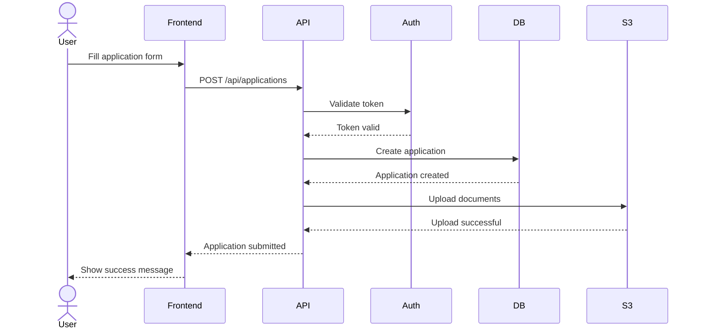
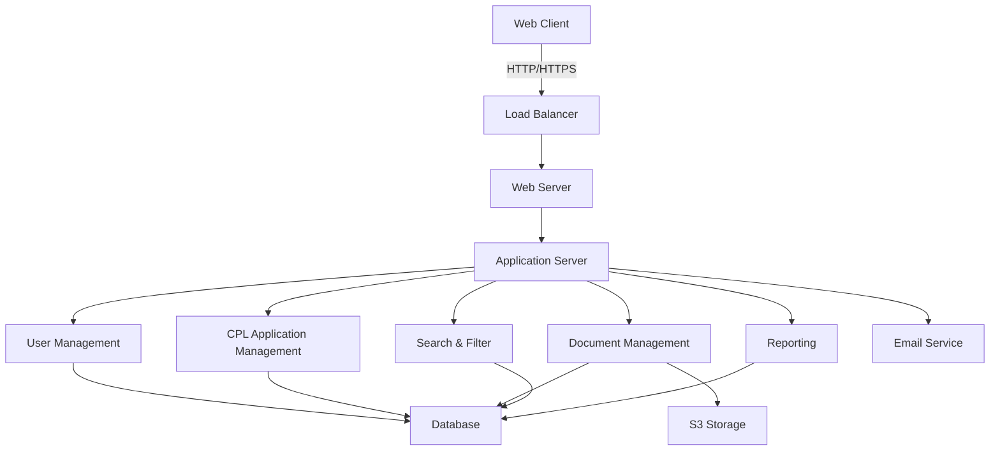
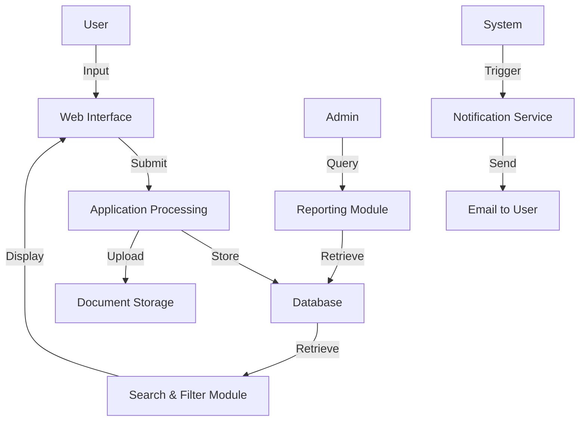

# Comprehensive Technical Implementation Plan: CPL Database

## 1. Project Overview

### Purpose

The main purpose of the CPL Database tool is to streamline the Conditional Permanent Living (CPL) application process, improve data management, and enhance reporting capabilities for the CPL program.

### Scope

- Web-based application for CPL data management
- User authentication and authorization system
- Database to store CPL application data
- Data entry forms for CPL applications
- Search and filter functionality
- Reporting capabilities
- Data export functionality

Out of scope:

- Public-facing application portal for applicants
- Integration with payment systems
- Automated decision-making for CPL applications

### Stakeholders

- Product Owner: [Name], responsible for defining requirements and priorities
- Development Team: Frontend and backend developers, database specialist
- QA Team: Responsible for testing and quality assurance
- End Users: Administrative staff managing CPL applications
- IT Operations: Responsible for deployment and maintenance

## 2. Requirements Analysis

### Functional Requirements

1. User authentication and role-based access control
2. CRUD operations for CPL applications
3. Document upload and management for CPL applications
4. Advanced search and filtering of CPL applications
5. Reporting functionality with various predefined reports
6. Data export in multiple formats (CSV, Excel)
7. Email notifications for application status updates

### Non-Functional Requirements

1. Performance: Page load times under 2 seconds, search results returned within 3 seconds
2. Scalability: Support up to 1000 concurrent users
3. Security: Encrypt all data in transit and at rest, implement secure authentication
4. Usability: Intuitive interface with minimal training required for staff
5. Availability: 99.9% uptime during business hours

### Technical Requirements

1. Frontend: React.js
2. Backend: Node.js with Express.js
3. Database: PostgreSQL
4. Authentication: JSON Web Tokens (JWT)
5. Cloud Platform: Amazon Web Services (AWS)
6. Version Control: Git with GitHub
7. CI/CD: GitHub Actions

## 3. System Architecture and Design

## High-Level Architecture

The CPL Database system follows a client-server architecture:

1. **Client**: React.js single-page application accessed via web browsers.
2. **Load Balancer**: Distributes incoming traffic across multiple web servers for high availability.
3. **Web Server**: Nginx servers to handle static content and route requests.
4. **Application Server**: Node.js with Express.js, handling business logic and API requests.
5. **Database**: PostgreSQL for data storage.
6. **Auth Service**: Handles user authentication and authorization.
7. **S3 Bucket**: For storing uploaded documents and generated reports.
8. **SES (Simple Email Service)**: For sending email notifications.
9. **Admin Dashboard**: Separate React application for system administration.

## Component Design

1. **User Management Module**

   - Responsibilities: User registration, authentication, and authorization
   - Interactions: Communicates with Auth Service and Database

2. **CPL Application Module**

   - Responsibilities: CRUD operations for CPL applications, status updates
   - Interactions: Communicates with Database and S3 Bucket for document storage

3. **Search and Filter Module**

   - Responsibilities: Provides advanced search and filtering capabilities
   - Interactions: Queries Database based on user input

4. **Reporting Module**

   - Responsibilities: Generates various reports based on CPL data
   - Interactions: Queries Database, generates reports, stores in S3 Bucket

5. **Data Export Module**

   - Responsibilities: Exports CPL data in various formats (CSV, Excel)
   - Interactions: Queries Database, generates export files, stores in S3 Bucket

6. **Notification Module**

   - Responsibilities: Sends email notifications for application updates
   - Interactions: Communicates with SES for email delivery

7. **Document Management Module**
   - Responsibilities: Handles upload, storage, and retrieval of CPL-related documents
   - Interactions: Communicates with S3 Bucket for document storage and retrieval

## Data Model

This data model represents the core entities in the CPL Database system:

- **User**: Represents system users with different roles (Admin, Manager, Staff).
- **CPL_Application**: Stores information about CPL applications.
- **CPL_Document**: Manages documents associated with CPL applications.
- **Application_History**: Tracks the history of changes to CPL applications.

## Integration Design

1. **Email Integration (SES)**

   - Purpose: Send notifications to applicants and staff
   - Integration Method: AWS SDK for Node.js to interact with SES
   - Data Flow: Application server sends email content and recipient info to SES

2. **Document Storage Integration (S3)**

   - Purpose: Store and retrieve CPL-related documents
   - Integration Method: AWS SDK for Node.js to interact with S3
   - Data Flow:
     - Upload: Client sends document to server, server uploads to S3
     - Retrieval: Server requests document from S3, sends to client

3. **Authentication Service**

   - Purpose: Manage user authentication and authorization
   - Integration Method: Custom authentication service or third-party service like Auth0
   - Data Flow: Client sends credentials, auth service validates and returns token

4. **Reporting Tools Integration**

   - Purpose: Generate advanced reports and visualizations
   - Integration Method: Server-side integration with reporting library (e.g., D3.js)
   - Data Flow: Server queries database, generates report using library, sends to client

5. **Legacy System Integration (if applicable)**

   - Purpose: Import existing CPL data from legacy systems
   - Integration Method: Custom ETL (Extract, Transform, Load) scripts
   - Data Flow: ETL script extracts data from legacy system, transforms to new schema, loads into new database

6. **API Integration for External Services**
   - Purpose: Allow authorized external services to access CPL data
   - Integration Method: RESTful API with authentication
   - Data Flow: External service authenticates, makes API requests, server responds with data

By implementing these integrations, the CPL Database system will be able to efficiently communicate with external services, manage documents, send notifications, and provide robust reporting capabilities while maintaining data security and integrity.

# Sequence Diagram

# CPL Database Component Diagram

# CPL Database Data Flow Diagram

## 4. Implementation Strategy

### Development Methodology

We will use an Agile Scrum methodology for this project. This approach allows for iterative development, frequent stakeholder feedback, and flexibility to adapt to changing requirements.

### Milestones and Timeline

1. Sprint 0 (1 week): Project setup and initial planning
2. Sprint 1-2 (4 weeks): User management and authentication system
3. Sprint 3-4 (4 weeks): CPL application module and database implementation
4. Sprint 5-6 (4 weeks): Search, filter, and reporting functionalities
5. Sprint 7-8 (4 weeks): Document management and data export features
6. Sprint 9 (2 weeks): Testing, bug fixes, and performance optimization
7. Sprint 10 (2 weeks): Deployment preparation and user acceptance testing

## 5. Development Environment Setup

### Tools and Technologies

- IDE: Visual Studio Code
- Frontend: React.js, Redux, Axios
- Backend: Node.js, Express.js, Sequelize ORM
- Database: PostgreSQL
- API Testing: Postman
- Version Control: Git, GitHub
- CI/CD: GitHub Actions
- Cloud Services: AWS (EC2, RDS, S3, SES)

### Version Control

We will use Git for version control with the following branching strategy:

- `main`: Production-ready code
- `develop`: Integration branch for features
- `feature/*`: Individual feature branches
- `hotfix/*`: Emergency fixes for production

### Sample Code and UI for Dashboard

### Development Environment Setup

1. Clone the repository: `git clone [repository-url]`
2. Install Node.js and npm
3. Install project dependencies: `npm install`
4. Set up local PostgreSQL database
5. Configure environment variables (database connection, AWS credentials, etc.)
6. Run the application: `npm run dev`

## 6. Testing and Quality Assurance

### Testing Strategy

1. Unit Testing: Jest for both frontend and backend unit tests
2. Integration Testing: Supertest for API integration tests
3. End-to-End Testing: Cypress for frontend E2E tests
4. Performance Testing: Apache JMeter for load and stress testing
5. Security Testing: OWASP ZAP for vulnerability scanning

### Test Environment Setup

1. Set up a dedicated test database
2. Configure test environment variables
3. Implement test data seeding scripts

### Test Case Development

1. Develop unit test cases alongside feature development
2. Create integration test suites for each API endpoint
3. Design E2E test scenarios covering critical user journeys
4. Develop performance test scripts for load testing

### Bug Tracking

We will use GitHub Issues for bug tracking, with the following process:

1. QA or developers create issues for identified bugs
2. Product owner prioritizes bugs
3. Developers assign themselves to bugs and create fix branches
4. QA verifies fixes before closing issues

## 7. Deployment Plan

### Deployment Strategy

We will implement a CI/CD pipeline using GitHub Actions for automated testing and deployment.

### Environment Preparation

1. Set up staging and production environments on AWS
2. Configure environment-specific variables
3. Set up database replication for production

### Rollback Plan

1. Maintain versioned database schemas
2. Keep the previous version's AMI for quick rollback
3. Implement feature flags for gradual rollout and easy disabling

### Monitoring and Logging

1. Set up AWS CloudWatch for application and server monitoring
2. Implement structured logging using Winston
3. Set up alerts for critical errors and performance issues

## 8. Security Considerations

### Security Measures

1. Implement HTTPS for all communications
2. Use prepared statements to prevent SQL injection
3. Implement rate limiting on API endpoints
4. Regular security audits and penetration testing

### Authentication and Authorization

1. Use JWT for stateless authentication
2. Implement role-based access control (RBAC)
3. Secure password storage using bcrypt

### Data Protection

1. Encrypt sensitive data at rest using AWS RDS encryption
2. Implement field-level encryption for highly sensitive data
3. Use AWS S3 server-side encryption for stored documents

## 9. Documentation

### User Documentation

1. Create a user manual covering all features of the CPL Database tool
2. Develop quick-start guides for common tasks
3. Provide FAQ section for troubleshooting

### Technical Documentation

1. Maintain up-to-date API documentation using Swagger
2. Document database schema and relationships
3. Create architectural diagrams and component interaction documentation

### Training Materials

1. Develop video tutorials for key features
2. Create interactive training modules for new staff
3. Prepare train-the-trainer materials for super users

## 10. Post-Implementation Review

### Performance Review

1. Conduct system performance analysis against defined KPIs
2. Review system logs and metrics for bottlenecks or issues

### Feedback Collection

1. Conduct user surveys to gather feedback on usability and features
2. Hold retrospective meetings with the development team
3. Analyze support tickets for common issues or feature requests

### Continuous Improvement

1. Prioritize backlog based on user feedback and business value
2. Plan for regular performance optimization sprints
3. Stay updated with latest security patches and dependency updates

## 11. Maintenance and Support

### Support Plan

1. Establish a tiered support system (L1, L2, L3)
2. Set up a helpdesk system for tracking support tickets
3. Define SLAs for different types of issues

### Maintenance Schedule

1. Plan bi-weekly maintenance windows for non-disruptive updates
2. Schedule quarterly security patches and updates
3. Perform yearly system-wide review and optimization

### End-of-Life Strategy

1. Define criteria for major version upgrades
2. Plan for data migration and archiving strategies
3. Develop a communication plan for informing users about significant changes or deprecations
